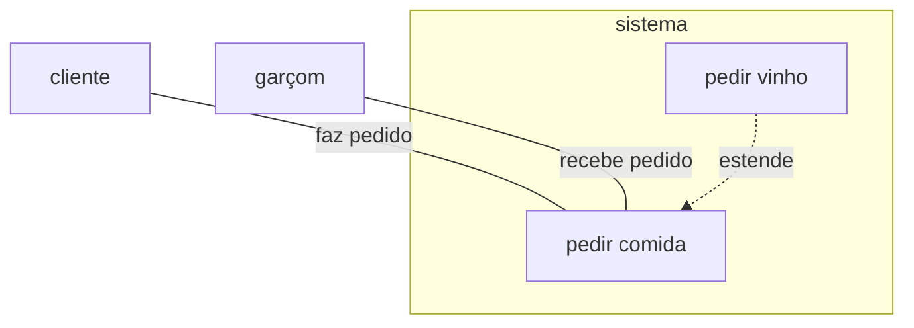
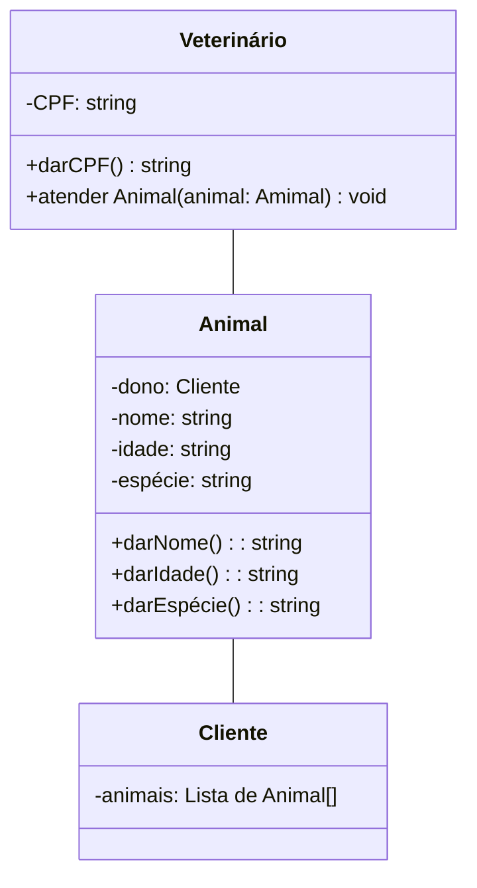

# trabalho-engenharia-software-2026
Trabalho de clínica veterinária do Técnico em Informática, segundo semestre de 2026. Eduarda Aparecida

Este repositório é onde vou guardar meu trabalho da disciplina de Engenharia de Software

protótipo do site de veterinária https://www.figma.com/design/pRAxrL7OQCi1t7lscXrpr3/Sem-t%C3%ADtulo?node-id=0-1&t=PlbzRAmXWYac0Rb8-1  25/9/26

## Diagramas UML

### Diagrama de caso de uso

### Diagrama de classe

2/10/26
